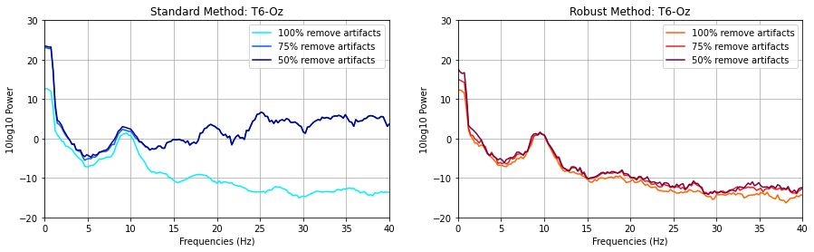

# Robust Power Estimation

This is C++ implementation of robust power estimation algorithm from paper:  
[Robust power spectral estimation for EEG data](https://pubmed.ncbi.nlm.nih.gov/27102041/).

## Introduction
The original paper proposed a robsut power estimation method using `median` or `quantile` to replace `mean` operation in averaging over trials, achieving promising result in data with many outliners.

The source code in original paper was written in MATLAB, this repo use C++ to implement this algorithm.

## Requirement
* gcc 7.5.0
* armadillo 10.7.3: `matrix operation`
* LAPACK: `math function`
* HDF5: `load eeg data from a hdf5 file`
* pybind11: `use scipy in getting chi2.ppf and beta function`
* yaml-cpp: `read .yaml configuration file`

## File Intro
* configuration file
    * method.yaml: robust power estimation method
    * standard.yaml: standard power estimation method
    * multitaper.yaml: dpss arguments

## Result

